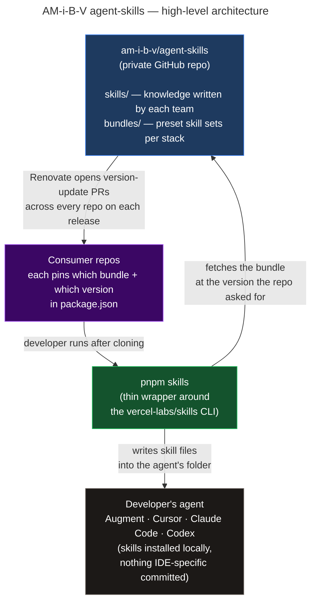

# Proposal: Org-Wide Agent Skills Distribution

## The Problem

Engineers at AM-i-B-V increasingly rely on AI agents. That only pays off if those agents reflect _our_ patterns — not generic ones picked up from the internet. Today they don't.

I ran into this firsthand while exploring our backend out of curiosity. Coming from TypeScript, I started picking up Scala through `testdrive-booking-service`, mirroring patterns from our omni-channel service. My AI was confidently wrong on almost every reflex — `Future` instead of `IO`, `sys.env` instead of ciris, hand-rolled mappings instead of ducktape, no awareness of the controller → service → repository contract. Writing a skill that taught it our stack fixed it for me. Every developer opening any other service starts from the same blind spot, and senior engineers catch the same mistakes in code review every day.

---

## What I Want to Build

A private GitHub repo, `am-i-b-v/agent-skills`, that holds all our AI guidance in one place. The people who know each area best write it down once as `SKILL.md` files — for whatever stack their team uses — and every developer's agent (Augment, Cursor, Claude Code, Codex) picks them up in any repo.

|                    | AGENTS.md                        | SKILL.md                                 |
| ------------------ | -------------------------------- | ---------------------------------------- |
| Answers            | _What is this project?_          | _How do we do X in this org?_            |
| Scope              | One repo                         | Follows the developer across all repos   |
| Content            | Build, architecture, local setup | Patterns, conventions, how-tos with code |
| Committed to repo? | Yes                              | No — installed into the agent            |

AGENTS.md tells the AI what this service is. Skills tell the AI how AM-i-B-V writes code — in whatever stack a team's working in.

---

## How It Works

```
am-i-b-v/agent-skills (private repo)
├── skills/
│   ├── <domain>/<skill-name>/SKILL.md   ← one folder per team's stack
│   │
│   │ starting set:
│   ├── backend-scala/patterns/SKILL.md         ← 8 working agreements + code
│   ├── backend-scala/error-handling/SKILL.md
│   ├── backend-scala/testing/SKILL.md
│   ├── frontend/nextjs-app-router/SKILL.md
│   └── shared/git-workflow/SKILL.md
├── bundles/
│   └── <stack>.json                            ← curated set per team / stack
└── bin/, lib/, scripts/, .github/              ← npm package + CI plumbing
```

The structure is open — any stack a team uses becomes another folder once they write their first skill, and any combination of skills becomes a bundle. Each repo that wants to use this pins the bundle it wants and the version it wants in `package.json`. Both our package and the upstream skills CLI it depends on are pinned by sha512 in `pnpm-lock.yaml`, so a republished tag can't silently change what any repo installs. A developer runs `pnpm skills` once after cloning, and their agent — whichever one they use — gets the full bundle installed into `.augment/`, `.cursor/`, `.claude/`, `.codex/`, etc. When a convention changes, one PR to `am-i-b-v/agent-skills` and Renovate automatically opens version-update PRs across every repo that uses it. No IDE-specific folders committed to repos.

---

## Architecture

Here's how it all fits together at a high level:



In practice: the source repo is published as a private npm package (`@am-i-b-v/agent-skills`) on GitHub Packages. Each consumer repo adds it as a dev dependency, names the bundle it wants in `package.json`, and adds two lines to `.npmrc` (registry + token) to point npm at the org's package registry. That's the entire consumer-side surface:

```json
{
  "scripts": { "skills": "ami-skills install" },
  "devDependencies": { "@am-i-b-v/agent-skills": "^1.0.0" },
  "agentSkills": { "bundle": "frontend" }
}
```

The wrapper itself lives inside the package, so a single update there reaches every repo on the next install.

---

## Why Build on Vercel's Skills CLI

The architecture above shows a "thin wrapper around the vercel-labs/skills CLI." That choice deserves a brief justification.

Vercel launched [skills.sh](https://skills.sh) in January 2026 as the "npm for agent skills" — a registry, leaderboard, and install CLI. We treat their CLI as a **commodity install primitive**, not a strategic dependency.

Four reasons it makes sense to lean on it rather than rebuild:

1. **Cross-agent installation is someone else's problem.** Each agent has its own conventional path — `.cursor/skills/`, `.claude/skills/`, `.codex/skills/`, plus the convergent `.agents/skills/`. The CLI auto-detects which agents are installed on the developer's machine and writes to all of them. Owning that detection + path matrix ourselves would mean tracking every agent's conventions forever, on their release cadence — not ours.

2. **`SKILL.md` is the portable contract — the CLI is not.** Our content is markdown with frontmatter sitting in a git repo. If Vercel pivots or we outgrow the CLI, the knowledge base is unaffected and a replacement installer is trivial. We're coupled to the format (which is becoming the de-facto standard), not to the tool.

3. **The security supply chain comes along for free.** Even for private org skills, the install-time scans from Vercel's security partners — Socket (static analysis + AI detection), Snyk (vulnerability scanning), and Gen (auditing) — still run through the CLI. Replicating that in-house is a full security product, not a side project.

4. **Time-to-pilot matches the "Why Now" argument.** Building a cross-agent installer from scratch is weeks of engineering — weeks where conventions keep diverging across teams. The wrapper approach gets a real pilot in days.

The boundary is intentionally clean: Vercel owns the install plumbing (the CLI is effectively a `cp -r` that understands agents); we own curation, gating, version pinning, and the content itself. When Vercel ships native manifests, the wrapper shrinks to almost nothing, the consumer-side config in `package.json` stays the same, and the source repo is unchanged — there is no scenario in which choosing the CLI now locks us in later.

---

## Why Now

The reason I'm proposing this now is timing. People are forming their AI habits right now — how they prompt, what they trust, what they double-check. If this shared content exists from the start, every developer who joins next month gets an AI that already knows our conventions. If we wait, we'll be trying to fix habits that have already settled in different ways across teams. The cost to build it is small and upfront; the payoff grows with every developer and every interaction.

---
