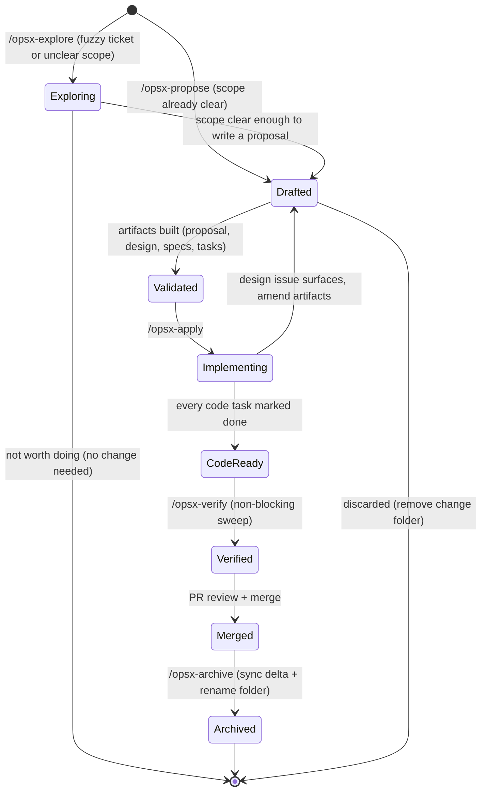
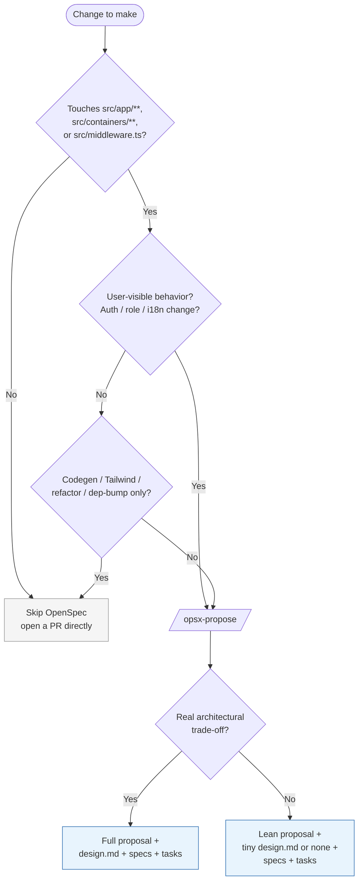
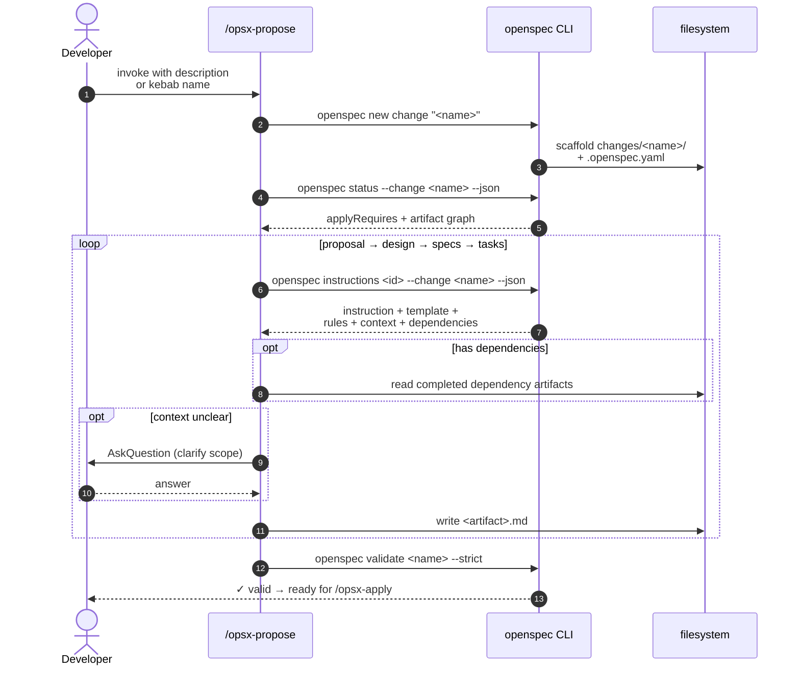
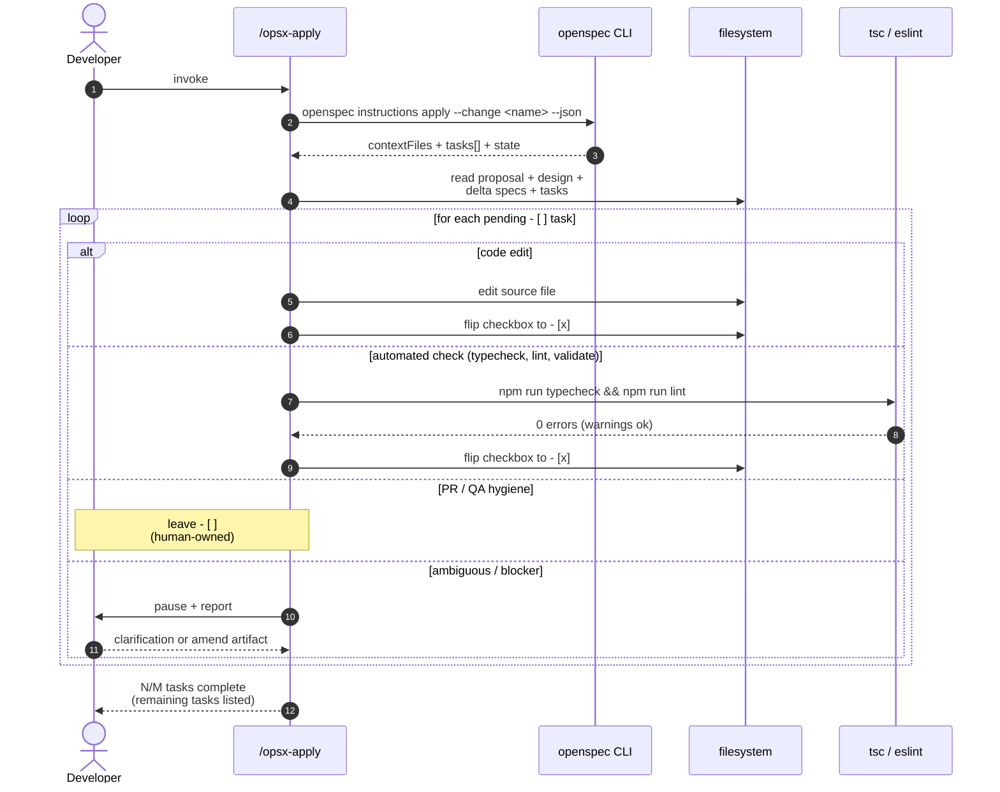
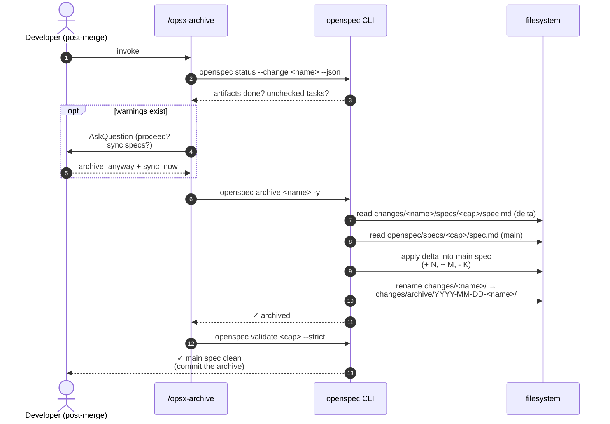
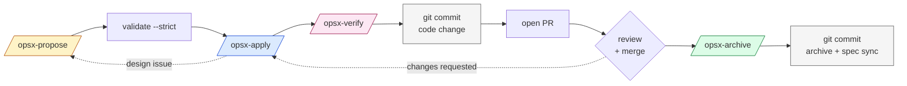
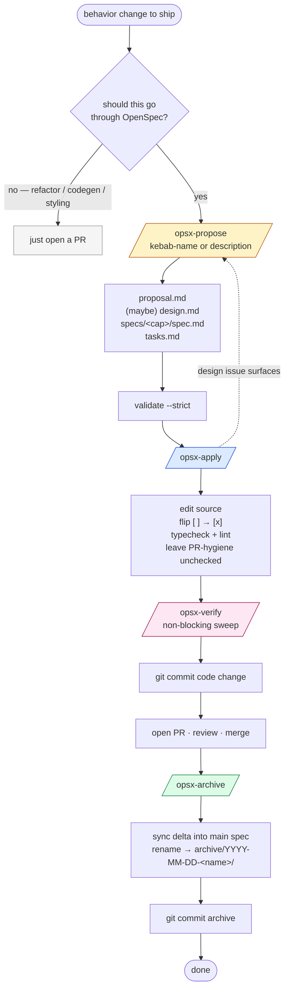

# OpenSpec dev workflow (analytics-web)

How a developer (or an AI agent driving on their behalf) actually ships a behavior change through OpenSpec in this repo. Grounded in the real change we shipped recently: `remove-show-underlying-data-sales-dashboard` — a one-line revert that pulls `Action.ShowUnderlyingData` out of the sales dashboard's `visibleActions` allowlist.

If you only remember three things:

1. **Four slash commands** drive the loop: `/opsx-explore` (unclear scope) → `/opsx-propose` → `/opsx-apply` → `/opsx-archive` (with `/opsx-verify` as a pre-archive sweep). Most tickets start with explore.
2. **Four artifacts per change**, built in dependency order: `proposal → design → specs → tasks`.
3. **The CLI is the source of truth.** Slash commands are just thin wrappers around `npx openspec ...` — when something looks weird, drop down to the CLI.

> **For the why-and-what-to-fix companion to this doc, see** `open-spec-improvements.md`.

---

## 1. Mental model

OpenSpec splits "what we want to change" from "what the system permanently behaves like":

```
openspec/
  config.yaml                         # repo-wide context + rules injected into every artifact prompt
  specs/<capability>/spec.md          # the living spec — what the system does today
  changes/<change-name>/              # an in-flight change proposal
    .openspec.yaml                    # schema marker (spec-driven)
    proposal.md                       # WHY + scope
    design.md                         # HOW (only if there's a real trade-off)
    specs/<capability>/spec.md        # the DELTA — ADDED / MODIFIED / REMOVED requirements
    tasks.md                          # the implementation checklist (- [ ] / - [x])
  changes/archive/YYYY-MM-DD-<name>/  # past changes, kept for history
```

`openspec/config.yaml` injects repo-wide context (Next.js 15, React Query, next-intl, container pattern, Playwright as primary verification, etc.) into every artifact prompt. **You do not paste this context yourself** — it's automatic. Just write your artifact.

A change always has exactly one `proposal.md`, optionally one `design.md`, one `tasks.md`, and one delta spec file per affected capability under `specs/<capability>/spec.md`.

### Change lifecycle

A change moves through seven states. Most tickets enter at Exploring, not Drafted — unclear requirements are the norm. The slash commands transition between them; the CLI does the actual work.



---

## 2. When to use OpenSpec, when to skip it

**Use it for:**

- Behavior changes in `src/app/**`, `src/containers/**`, `src/middleware.ts`.
- Anything user-visible (UI states, routes, role gates, embed configuration like the change we just shipped).
- Anything that affects auth, role gates, the `/analytics/api/verifyToken` flow, or i18n message keys.

**Skip it for:**

- Type-only / codegen-only changes (`npm run codegen` output).
- Pure styling / Tailwind class adjustments with no behavior change.
- CI-only or tooling-only PRs.
- Renames, refactors, dependency bumps that don't change behavior.

**Verbosity scales with change size.** A one-line allowlist edit warrants a ~15-line proposal, often no `design.md` at all (or a single paragraph if there's a real trade-off), and a tasks file with 4–6 actionable bullets. Don't pad. The rules in `openspec/config.yaml` are floors, not quotas.

### Decision flowchart



---

## 3. The slash commands

These live as Cursor commands in `.cursor/commands/` and as Claude Code commands in `.claude/commands/`. Both directories are gitignored — each developer regenerates them locally with:

> **Naming convention differs by tool.** Cursor invokes these as `/opsx-<cmd>` (hyphen — e.g. `/opsx-propose`). Claude Code invokes them as `/opsx:<cmd>` (colon — e.g. `/opsx:propose`). The commands and their behavior are identical; only the invocation syntax differs. This doc uses the Cursor hyphen form throughout.

```bash
npx openspec update          # regenerate for already-configured tools
npx openspec update --force  # re-emit even when up to date
```

> **Heads-up — there is no `--tools <list>` flag on `update`.** That option only exists on `openspec init`. The set of slash commands `update` writes is driven entirely by your **global OpenSpec config** at `~/.config/openspec/config.json` (`profile`, `workflows`, `delivery`). Earlier revisions of this doc told you to run `npx openspec update --tools cursor claude-code` — that is wrong on the pinned `@fission-ai/openspec ^1.3.1` and will no-op or error.

The default `core` profile ships exactly four workflows: `propose`, `explore`, `apply`, `archive`. The other seven (`new`, `continue`, `ff`, `sync`, `bulk-archive`, `verify`, `onboard`) are only emitted when `profile: "custom"`. To enable them — `verify` chief among them — run:

```bash
npx openspec config profile  # interactive picker: switch to `custom`, tick workflows
npx openspec update          # regenerate slash commands per the new profile
```

Re-run `openspec update` **after** every `@fission-ai/openspec` bump in `package.json`, and once after a fresh `git clone`. The slash commands are just thin wrappers around the CLI; when one drifts, drop to `npx openspec ...` directly.

### `/opsx-explore [topic or ticket description]`

Use this when the ticket is vague, requirements conflict, or you don't yet know what capability is actually affected. Explore is a thinking-partner session — it does not scaffold any files.

**Bring in:**

- The ticket description or Jira/Linear link
- Any relevant existing spec (`openspec/specs/<capability>/spec.md`) if you suspect it's in scope
- Screenshots, error logs, or stakeholder notes

**What it produces:**

- A clearer problem statement
- Candidate capabilities affected
- Enough scope to write a focused `proposal.md`

**When to stop:** When you can answer "what are we changing and why?" in two sentences. That answer becomes the description you hand to `/opsx-propose`.

**Explore does not create a change folder.** If exploration reveals no change is needed, nothing is left behind.

---

### `/opsx-propose <description-or-name>`

Scaffolds the change folder and walks `proposal → design → specs → tasks` in order, asking for clarification only when context is genuinely unclear.

Under the hood it runs:

```bash
npx openspec new change "<name>"                              # scaffolds folder + .openspec.yaml
npx openspec status   --change "<name>" --json                # gets the artifact graph
npx openspec instructions <artifact> --change "<name>" --json # for each artifact, in dep order
```

Each `instructions` call returns a JSON envelope with:

- `instruction` — schema-specific guidance for that artifact type
- `template` — the section structure to fill in
- `context` — repo-wide background (do **not** paste into the file; it's a constraint for you)
- `rules` — artifact-specific rules (also a constraint, not content)
- `dependencies` — completed artifacts you should read for context first
- `outputPath` — where to write

For `MODIFIED Requirements`, you must paste the **entire existing requirement block** from `openspec/specs/<capability>/spec.md` and edit it in place. Partial-content `MODIFIED` blocks lose detail at archive time — this is the single most common authoring mistake.



### `/opsx-apply [name]`

Reads context (`proposal`, `design`, `specs`, `tasks`), then loops through `- [ ]` checkboxes in `tasks.md`, making the code edits and flipping each box to `- [x]` as it goes. It pauses on:

- An unclear task (asks for clarification)
- A blocker (e.g. missing dependency, broken types)
- A discovered design issue (suggests amending an artifact rather than guessing)

Tasks that are _PR/QA hygiene_ (manual click-through, "note in PR description", "archive after merge") stay unchecked — those belong to the human, not the agent.



### `/opsx-verify` (recommended, non-blocking)

> **Prerequisite — opt-in workflow.** `verify` is **not** part of the default `core` profile. Until you run `npx openspec config profile`, switch to `custom`, tick `verify`, and then `npx openspec update`, the slash command will not exist on your machine. See §3 above.

Run between `/opsx-apply` and `/opsx-archive`. It sweeps the change against three axes:

- **Completeness** — all tasks done, requirements coded, scenarios tested.
- **Correctness** — implementation matches spec intent; edge cases handled.
- **Coherence** — design decisions reflected in code structure and naming.

It is non-blocking by design ([upstream workflows doc](https://github.com/Fission-AI/OpenSpec/blob/main/docs/workflows.md)): it surfaces issues at the point they are cheapest to fix. **For high-risk changes** (auth, middleware, role gates, anything that ships across multiple capabilities) treat it as mandatory; for trivial allowlist edits and config flips it remains a habit.

### `/opsx-archive [name]`

After the PR merges:

1. Verifies all artifacts are `done` (warns if not, asks before continuing).
2. Counts unchecked tasks (warns if > 0, asks before continuing — the unchecked PR/QA tasks are normal).
3. Diffs the change's delta specs against `openspec/specs/<capability>/spec.md` and offers to **sync** them.
4. Renames `openspec/changes/<name>/` → `openspec/changes/archive/YYYY-MM-DD-<name>/`.

The actual work is one CLI call: `npx openspec archive <name> -y`. That command applies the delta into the main spec **and** moves the folder atomically. Do not move the folder by hand — you'll skip the spec sync.



### Expanded workflow commands (custom profile only)

The seven commands below are not available on the default `core` profile. Enable them by running `npx openspec config profile`, switching to `custom`, ticking the workflows you want, then `npx openspec update`.

---

#### `/opsx-new [name]`

Creates the change scaffold (`openspec/changes/<name>/` + `.openspec.yaml`) with **no artifacts**. Use this as the starting point when you want to generate and review one artifact at a time rather than the whole plan in one shot — follow it with `/opsx-continue`.

---

#### `/opsx-continue [name]`

Generates the **next artifact in the dependency chain**, one at a time, then stops so you can review before proceeding. Reads all completed artifacts for context, shows what is ready vs blocked, and tells you what to run next.

Order: `proposal.md` → `design.md` → `specs/<capability>/spec.md` → `tasks.md`.

Use this when:

- The change is large enough that you want a human sign-off on the proposal before the design is written.
- You are iterating on the design doc before locking in tasks.
- You interrupted a `/opsx-propose` session mid-way and need to resume from the last completed artifact.

---

#### `/opsx-ff [name]`

Fast-forward — generates **all remaining artifacts at once**, respecting dependencies, but reading each completed artifact before writing the next. Faster than `/opsx-continue` because it doesn't pause; slower than `/opsx-propose` because it surfaces each artifact as it goes.

Use when:

- You used `/opsx-new` to start the change but now want to complete planning quickly.
- You want to see the artifacts as they are produced without waiting for interactive review.

Equivalent to running `/opsx-continue` in a tight loop until all artifacts are done.

---

#### `/opsx-sync [name]`

Merges the change's delta specs (`openspec/changes/<name>/specs/<cap>/spec.md`) into the living spec (`openspec/specs/<cap>/spec.md`) **without archiving the change**. The change folder stays active.

Use this for long-running branches where other changes have already archived and updated the main spec. Sync your delta forward before archiving so you're not overwriting recent updates.

> **Normally you won't need this directly.** `/opsx-archive` offers to sync as part of its flow. Only reach for `/opsx-sync` explicitly when you need an up-to-date base spec mid-flight (e.g. before rebasing a long branch).

---

#### `/opsx-bulk-archive`

Archives **multiple completed changes** in one pass. Detects spec conflicts across the batch and resolves them by inspecting the current codebase state rather than guessing from artifact order.

Use when:

- You have been running parallel feature branches (`sales-dashboard` + `leads-dashboard` changes) and both landed around the same time.
- You let several small changes pile up and want to clean up the `openspec/changes/` folder in one go.

> Still run `npx openspec validate --all --strict` after bulk-archiving to verify the merged main specs are consistent.

---

#### `/opsx-onboard`

Interactive tutorial that walks a new developer through the **complete OpenSpec cycle on the real codebase** — finding an improvement opportunity, creating a change, implementing it, and archiving it — with narration at each step.

Intended for:

- New teammates being introduced to the spec-driven workflow in this repo.
- Developers familiar with OpenSpec in general but unfamiliar with how it is configured here (artifact shapes, `config.yaml` context injection, naming conventions).

Not intended for active feature work.

---

### Choosing a path

| Situation                                                         | Path                                                                                  |
| ----------------------------------------------------------------- | ------------------------------------------------------------------------------------- |
| Scope is clear, change is self-contained                          | `/opsx-propose` → `/opsx-apply` → `/opsx-archive`                                     |
| Requirements are fuzzy                                            | `/opsx-explore` → `/opsx-propose` → `/opsx-apply` → `/opsx-archive`                   |
| Complex change; want to review each artifact before the next      | `/opsx-new` → `/opsx-continue` × N → `/opsx-apply` → `/opsx-verify` → `/opsx-archive` |
| Confident on scope, want artifacts visible but fast               | `/opsx-new` → `/opsx-ff` → `/opsx-apply` → `/opsx-verify` → `/opsx-archive`           |
| Long-running branch; base spec has drifted                        | … → `/opsx-sync` → rebase → `/opsx-apply` → `/opsx-archive`                           |
| Multiple parallel branches just merged                            | `/opsx-bulk-archive`                                                                  |
| Pre-archive safety check on auth / middleware / multi-cap changes | … → `/opsx-verify` → `/opsx-archive`                                                  |
| Onboarding a new developer                                        | `/opsx-onboard` (standalone — not during active feature work)                         |

The **core profile** covers the first two rows. Anything below requires switching to `custom` (`npx openspec config profile` → `npx openspec update`).

---

## 4. End-to-end walkthrough

This is the change we shipped recently, command by command.

### 4.0 The whole journey at a glance



### 4.1 Propose

```
/opsx-propose remove show underlying data for sales dashboard from visible actions allowlist
```

What happened:

1. Scaffolded `openspec/changes/remove-show-underlying-data-sales-dashboard/` with `.openspec.yaml`.
2. Built `proposal.md` — Why (data owner reported aggregation-hidden rows getting exposed), What (delete one line + spec delta), in-scope / out-of-scope, Capabilities (`sales-dashboard` modified), Impact (route, container, rollback).
3. Built `design.md` — kept it short because the change is trivial. Recorded the one real trade-off (remove outright vs. flag) and a comment-hygiene note (don't leave a `// Action.ShowUnderlyingData,` placeholder).
4. Built the delta spec at `specs/sales-dashboard/spec.md`. Started with a `REMOVED Requirements` section by mistake, then realized the doomed item was a _Scenario_ under `Liveboard embed configuration`, not a top-level Requirement — so it's just a `MODIFIED Requirements` block with the Scenario dropped and the visibleActions list shrunk from 10 → 9 entries. **Lesson: a Scenario disappearing inside a Requirement is a `MODIFIED` operation, not a `REMOVED` one.**
5. Built `tasks.md` — 4 numbered groups (Pre-merge / Code / Verify / Archive), 6 bullets total, all checkboxes.
6. Validated: `npx openspec validate remove-show-underlying-data-sales-dashboard --strict` → passed.

### 4.2 Apply

```
/opsx-apply
```

What happened:

1. Resolved the change name from conversation context (no need to type it).
2. Read `tasks.md` and worked through it:
   - **2.1** — Deleted the `Action.ShowUnderlyingData,` line from `src/containers/sales-dashboard/SalesDashboard.client.tsx`. Did **not** leave a placeholder comment behind.
   - **3.1** — `npm run typecheck && npm run lint` both pass; the 21 ESLint warnings are pre-existing.
   - **4.1** — `npx openspec validate ... --strict` passes.
3. Tasks **1.1** (PR description note), **3.2** (manual `en`+`nl` click-through), and **4.2** (the archive itself) were left unchecked — they need a human / a real PR / a running app, and that's expected.
4. Showed status: 3/6 complete, paused with the remaining-tasks list.

### 4.3 Verify (recommended)

```
/opsx-verify
```

For this change it would have flagged: _"Tests: empty section under §3 — is there a Vitest or Playwright test that should land?"_ Answer: no — the verification note Scenario already documents that the iframe DOM isn't observable, so the array literal change is verified by code review + `validate --strict`. That's the kind of question `/opsx-verify` is designed to surface so the author can answer it explicitly rather than implicitly.

### 4.4 Archive

```
/opsx-archive
```

What happened:

1. `npx openspec status --change ... --json` confirmed all 4 artifacts `done`.
2. Counted 3 unchecked tasks — confirmed proceeding (those tasks are PR/QA hygiene).
3. Diffed `specs/sales-dashboard/spec.md` (delta) against `openspec/specs/sales-dashboard/spec.md` (main) — confirmed sync.
4. Ran `npx openspec archive remove-show-underlying-data-sales-dashboard -y`. Output:
   ```
   Specs to update:
     sales-dashboard: update
   Applying changes to openspec/specs/sales-dashboard/spec.md:
     ~ 1 modified
   Totals: + 0, ~ 1, - 0, → 0
   Specs updated successfully.
   Change '...' archived as '2026-04-27-remove-show-underlying-data-sales-dashboard'.
   ```
5. `npx openspec validate sales-dashboard --strict` confirmed the synced main spec is clean.

### 4.5 Commit

The implementation commit (the one-line code edit) is **separate** from the archive commit. Two commits, in this order:

1. Code change with a short opsx-flavored message: `disable show underlying data for sales dashboard using opsx`.
2. Archive + main-spec sync: `archive remove-show-underlying-data-sales-dashboard opsx change`.

This split keeps `git blame` on the source line clean and lets you revert behavior without reverting the openspec history.

---

## 5. CLI cheatsheet

The slash commands wrap these. Use them directly when scripting, when something goes wrong, or when you just want to look around.

```bash
# Discover
npx openspec list                                     # active changes
npx openspec list --specs                             # capabilities (living specs)
npx openspec show <change-or-spec>                    # render a change or spec

# Propose / inspect
npx openspec new change "<name>"                      # scaffold (kebab-case)
npx openspec status --change "<name>" --json          # artifact graph + applyRequires
npx openspec instructions <artifact> --change "<name>" --json
                                                      # artifact: proposal | design | specs | tasks
npx openspec instructions apply --change "<name>" --json
                                                      # implementation context + task list

# Validate
npx openspec validate <name> --strict                 # validate a change
npx openspec validate <capability> --strict           # validate a living spec
npx openspec validate --all --strict                  # everything

# Archive
npx openspec archive <name>                           # interactive (prompts)
npx openspec archive <name> -y                        # skip prompts
npx openspec archive <name> --skip-specs              # tooling/doc-only changes
npx openspec archive <name> --no-validate             # dry-archive against a throwaway branch

# Tooling
npx openspec update                                   # regenerate slash commands for configured tools
                                                      # (run after every @fission-ai/openspec bump
                                                      #  or any `openspec config profile` change)
npx openspec update --force                           # re-emit even when up to date
npx openspec config profile                           # interactive: pick profile + workflows + delivery
                                                      # (use this to enable `verify`, `new`, `continue`,
                                                      #  `ff`, `sync`, `bulk-archive`, `onboard`)
npx openspec config list                              # show current profile + workflow set + delivery
```

---

## 6. Gotchas we hit (or nearly hit)

- **`MODIFIED` vs `REMOVED` Requirements.** `REMOVED` is for whole `### Requirement:` blocks. Dropping a `#### Scenario:` from inside a Requirement is part of a `MODIFIED` block — paste the full Requirement, then edit. We almost wrote a stray `## REMOVED Requirements` section for a Scenario; caught it before `validate`.
- **Don't paste `<context>` or `<rules>` into the artifact file.** The `openspec instructions ... --json` output gives you those as JSON fields. They are constraints for the writer, not content for the file. Templates also include `<!-- HTML comments -->` as authoring hints; strip them.
- **Don't sync specs by hand.** `npx openspec archive` does the sync atomically. Editing `openspec/specs/<capability>/spec.md` directly and _then_ archiving will produce confusing diffs and may leave the spec inconsistent.
- **Don't add a Vitest test for `visibleActions` unless you actually have one.** The tasks.md template is a _floor_ for normal changes; for a one-line allowlist edit there's no test layer to update. List only actionable items, never `N/A — not modified` placeholder bullets. **NB:** the Vitest claim in `AGENTS.md` / `config.yaml` is currently unfounded — see `open-spec-improvements.md` §2.1.
- **PR-hygiene tasks stay unchecked.** "Note in PR description", "manual click-through", and "after merge, archive" are real tasks — they just don't belong to the apply-loop. The `--yes` archive flag is the right way to acknowledge them at archive time.
- **`-y` skips warnings, not validation.** `npx openspec archive ... -y` will still fail if the strict validation fails. If you want to bypass validation (almost never), use `--no-validate` separately.
- **`validate --strict` does NOT guarantee `archive` will succeed.** Per the [upstream parallel-merge plan](https://github.com/Fission-AI/OpenSpec/blob/main/openspec-parallel-merge-plan.md), there are reported cases where validation passes but archive fails downstream (parser miscount under fenced code blocks; deltas that are valid in isolation but reference requirements no longer present after a sibling archive). For high-risk changes, **dry-archive first** in a throwaway worktree: `npx openspec archive <name> --no-validate`, inspect the merged spec, then run the real archive.
- **Parallel changes can silently corrupt main specs.** OpenSpec's archive replaces entire requirement blocks without conflict detection. **One active change per `### Requirement:` block at a time.** When parallel work is unavoidable, the second author MUST rebase their delta against the first change's merged main spec before archiving.
- **No `###` headers inside fenced code blocks.** The OpenSpec parser has been reported to mis-count requirement headers when they appear inside fenced blocks. Quote with inline code (`` `### Requirement: X` ``) or leading whitespace instead.
- **The `core` profile silently ignores the `workflows` array.** Your global `~/.config/openspec/config.json` may list any subset of the 11 available workflows under `workflows`, but if `profile: "core"` is set, that list is **ignored** — the `core` profile is hard-coded to exactly `propose`, `explore`, `apply`, `archive` (see `node_modules/@fission-ai/openspec/dist/core/profiles.js`). To enable `verify`, `new`, `continue`, `ff`, `sync`, `bulk-archive`, or `onboard`, switch to `profile: "custom"` (cleanest via `npx openspec config profile`), then `npx openspec update`. **There is also no `--tools` flag on `update`** — that option lives on `init`. Tool selection (Cursor / Claude Code / both) is decided by `delivery` in the same global config.
- **Two commits, not one.** Keep the source-code change and the archive (rename + spec sync) in separate commits, in that order. Revertability matters more than commit count.

---

## 7. When things go wrong

| Symptom                                                                                                   | Likely cause                                                                      | Fix                                                                                                              |
| --------------------------------------------------------------------------------------------------------- | --------------------------------------------------------------------------------- | ---------------------------------------------------------------------------------------------------------------- |
| `validate ... --strict` fails on `MODIFIED Requirements`                                                  | Pasted only the changed Scenario, not the whole Requirement                       | Copy the full `### Requirement:` block from the main spec, paste under `## MODIFIED Requirements`, edit in place |
| `archive` says "Specs to update: `<capability>`: update" but main spec doesn't change                     | Delta is identical to main (already synced)                                       | Safe to ignore; you may have hand-edited earlier                                                                 |
| `archive` reports "Target archive directory already exists"                                               | Re-archiving on the same date                                                     | Rename / delete the old archive folder, or wait until tomorrow                                                   |
| `archive` succeeds but a Scenario silently disappeared from the main spec                                 | A sibling change archived first and replaced the requirement block                | Re-author the delta against the **current** main spec; consider `--no-validate` dry-archive next time            |
| Slash command refuses to start                                                                            | Missing artifact dependency                                                       | Run `openspec status --change ... --json` and look at `missingDeps`                                              |
| Slash command behaves differently from CLI docs                                                           | Local slash files lag the CLI version                                             | `npx openspec update` (or `--force`) — there is no `--tools` flag on `update`                                    |
| `npx openspec update` ran cleanly but `/opsx-verify` (or another non-core workflow) still isn't installed | Global config has `profile: "core"`, which silently ignores the `workflows` array | `npx openspec config profile` → choose `custom` → tick the workflow → `npx openspec update`                      |
| Apply loop guesses wrong                                                                                  | Task description was vague                                                        | Pause, edit the task in `tasks.md` with the right specifics, re-run `/opsx-apply`                                |
| Code change shipped but spec wasn't updated                                                               | Skipped `archive`, or used `git mv` instead                                       | Re-run `npx openspec archive <name>` from the original (un-renamed) folder                                       |

---

## 8. The one-page TL;DR



That's the whole loop.

---

## 9. References

- [OpenSpec — repo](https://github.com/Fission-AI/OpenSpec) · [`docs/concepts.md`](https://github.com/Fission-AI/OpenSpec/blob/main/docs/concepts.md) · [`docs/workflows.md`](https://github.com/Fission-AI/OpenSpec/blob/main/docs/workflows.md) · [parallel-merge plan](https://github.com/Fission-AI/OpenSpec/blob/main/openspec-parallel-merge-plan.md)
- In-repo: `AGENTS.md`, `openspec/config.yaml`, `open-spec-improvements.md`, `openspec-adoption-addendum.md`.
